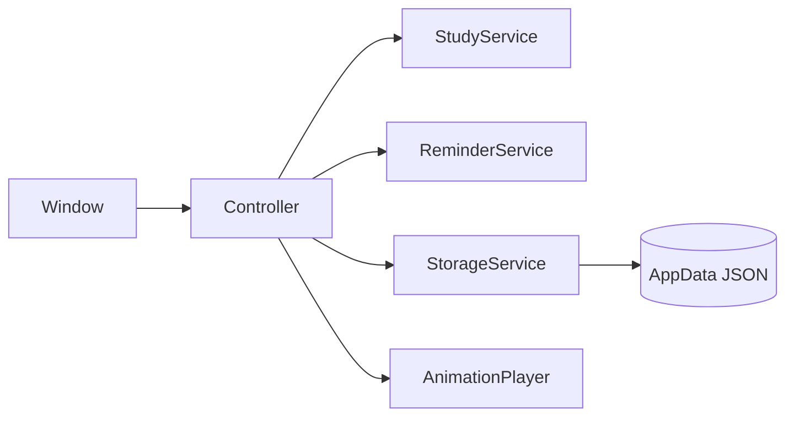

# 架构

`PetController` 负责协调窗口与服务；`PetWindow` 仅处理桌面交互；`AnimationPlayer` 管理 PNG 帧；`StudyService` 管理可测试的计时状态；`ReminderService` 管理提醒计时器；`StorageService` 管理 JSON 与原子写入；`PetStats` 管理数值边界与奖励规则。

```mermaid
flowchart LR
  Window --> Controller
  Controller --> StudyService
  Controller --> ReminderService
  Controller --> StorageService
  Controller --> AnimationPlayer
  StorageService --> AppData[(AppData JSON)]
```

