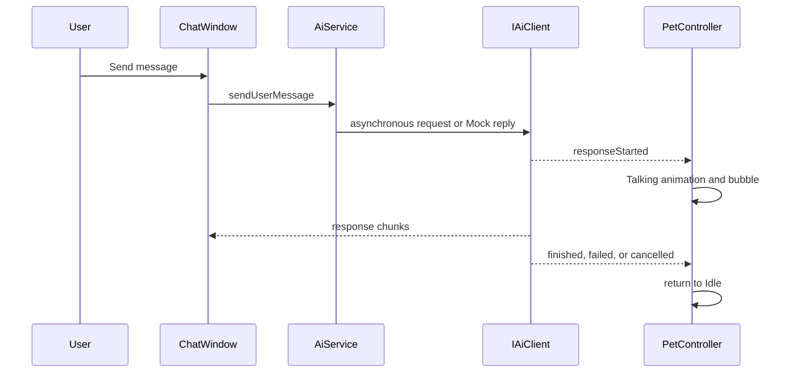

# Phase 4: Optional AI chat

## Modules

`ChatWindow` renders the conversation and emits user actions. `AiService` owns the short history and chooses an `IAiClient`. `MockAiClient` is the safe offline implementation. `OpenAiCompatibleClient` uses `QNetworkAccessManager`, a timeout timer, and incremental `data:` parsing for compatible streaming replies.

## Security and configuration

Non-secret Base URL, model, timeout and context limit are stored in `QStandardPaths::AppDataLocation/study-pet.json`. API keys are never stored there. The only accepted key sources are `STUDYPET_API_KEY` and ignored `config/private.json`; `config/private.example.json` is a non-secret template. No key or Authorization value is logged.

## Offline mode and resilience

No key selects Mock mode automatically and is visibly labelled in the window. It returns a local demo response and never calls the network. Online requests are asynchronous and handle cancellation, timeout, HTTP error, network error and malformed payload. Any completion path returns the pet from Talking to Idle.

## History and tests

At most 20 messages are retained by default. Clear conversation deletes the local history immediately. Invalid JSON or malformed history falls back safely. `TestStage4` uses Mock clients only and covers fallback, cancellation, error, trimming/clearing, storage and Talking-to-Idle.

