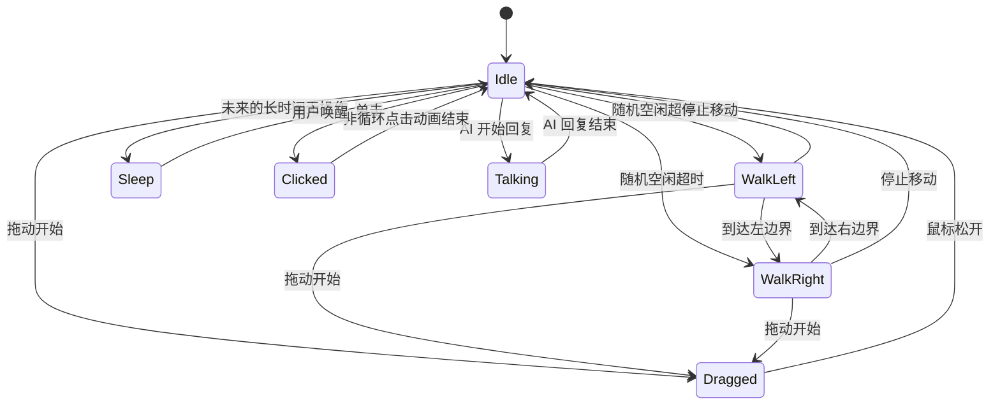

# 桌宠行为状态机

`PetStateMachine` 是纯 C++ 转换表，不依赖 QWidget、QTimer 或渲染类；`PetController` 将状态结果映射为动画和移动定时器。因此状态规则可用 Qt Test 单独验证。



## 阶段 2 运行规则

- Idle 使用一次性随机计时器，3–7 秒后随机进入 `WalkLeft` 或 `WalkRight`。
- 行走由 30 ms 的 `QTimer` 驱动，每次移动 2 像素；不使用忙等循环。
- `PetWindow` 根据当前显示器的 `availableGeometry()` 夹紧坐标。控制器收到左/右边界结果后使状态机转向。
- 指针位移未超过 Qt 拖动阈值时视为单击；超过阈值时进入 `Dragged`，自动移动计时器停止。
- `Clicked` 使用非循环动画；播放器完成后通知控制器恢复 Idle。

## 转换约束

不属于上图的直接转换将返回 `false` 并保留原状态，例如 `WalkLeft → Sleep`。这避免窗口事件绕过业务规则。

## 阶段 2 验证记录

2026-09-16 在当前开发环境实际执行了以下检查：

```powershell
git diff --check
Get-Content -Raw resources/config/animations.json | ConvertFrom-Json
```

结果：Git 空白检查通过，动画 JSON 可解析，且 `.qrc` 中所有资源路径均存在。环境未找到 `cmake` 可执行程序，因此没有在本机声称完成 CMake Configure、编译或 CTest；`.github/workflows/windows-build.yml` 会在 Windows CI 上执行这些步骤。

